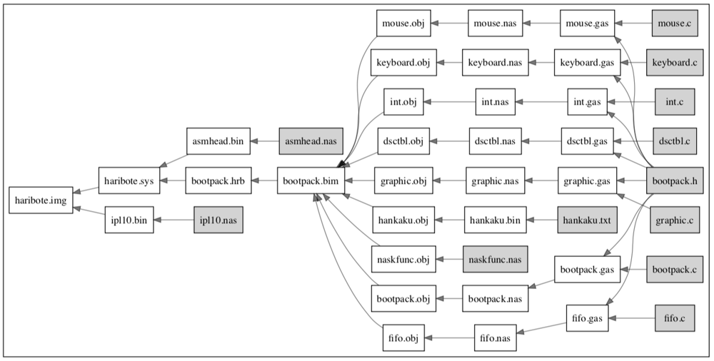

# Makefile-visualizer
This script visualizes the dependency of makefile and related files.

## Usage

1. Add makefile and related files to the directory.

2. You can generate makefile dependency graph as follows:

```bash
LANG=C make -p | python3 make_p_to_json.py | python3 json_to_dot.py | dot -Tpdf >| workflow.pdf
```

## Result
 

## Acknowledgement

I wish to thank kshramt for the original source code.

https://qiita.com/kshramt/items/dace8875d9686475f6cd
